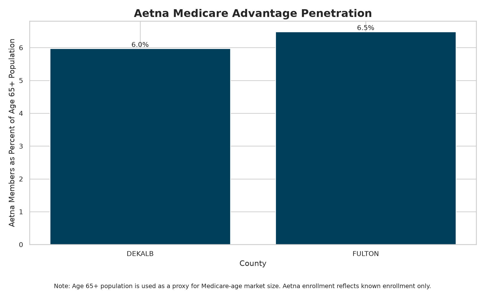
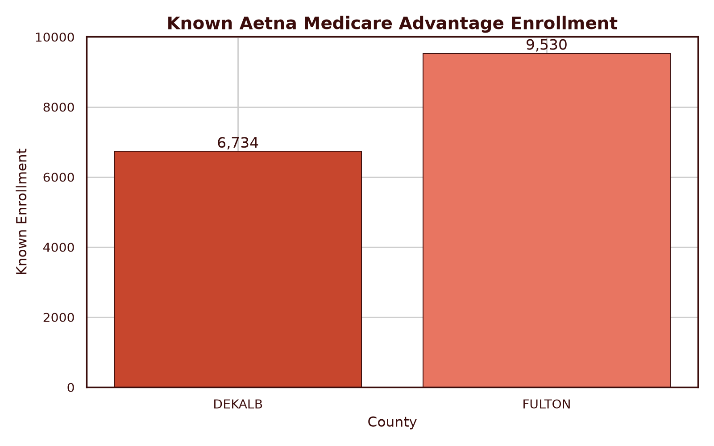
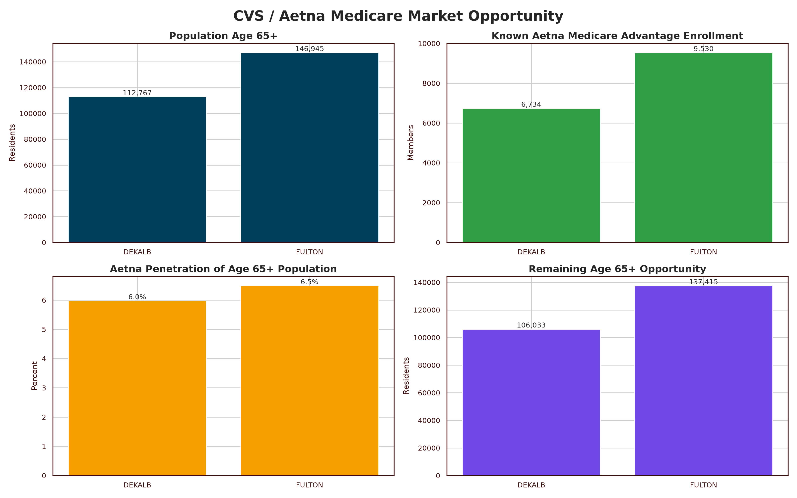
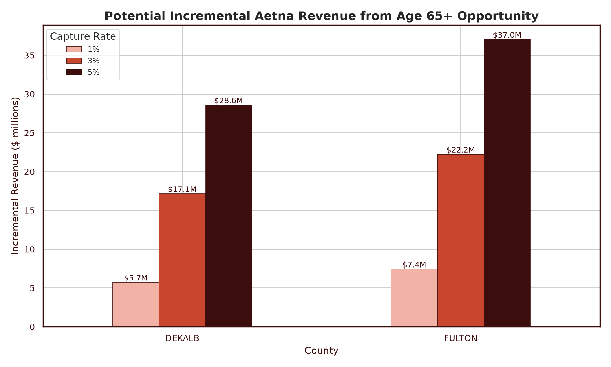
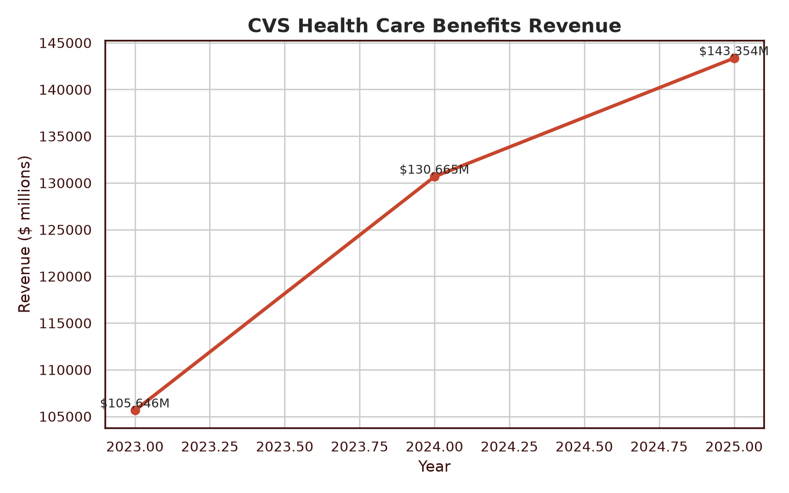
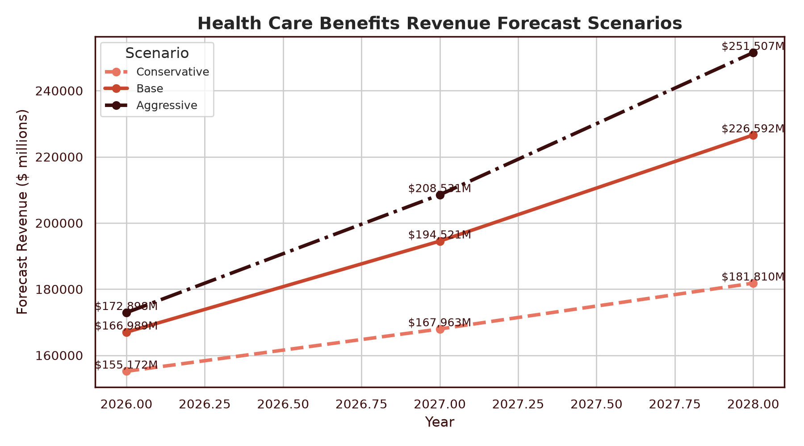

# Project HEART

## A Data-Driven Strategy for Expanding Healthcare Access in Fulton and DeKalb Counties

## Executive Summary

This report explains the full project story from community health burden to strategic CVS/Aetna opportunity. The central finding is that Fulton County and DeKalb County show a repeated burden from chronic disease, especially heart disease, stroke, cancer, and diabetes. Those outcomes intersect with education, socioeconomic vulnerability, race, and access barriers that shape whether residents can prevent disease, manage existing conditions, and receive care early.

The business implication is that CVS and Aetna can use targeted preventive care outreach to reach communities with both high health need and measurable Medicare-age market opportunity. A targeted model focused on screenings, nutrition support, care navigation, medication adherence, and partnership-based outreach creates a path to health impact while supporting future member growth and retention.

## How to Read This Report

Each section introduces the diagram type, defines important terms, explains the finding, and connects that finding to the next part of the analysis. Rankable causes of death are causes that can be compared across categories to identify which conditions create the largest mortality burden. Death counts show volume. Percent of deaths shows each cause's share within a selected source and county. Heatmaps use darker shading to show larger values. NCHS is kept separate from Georgia and OASIS because its source structure and cause groupings are not directly comparable.

## 1. Community Health Burden

The first set of diagrams identifies the leading causes of death in Fulton and DeKalb Counties. A heatmap is read by comparing the cause labels with the values inside each cell. Darker cells indicate a larger burden. The repeated finding is that chronic disease is central to the health access problem. This matters because chronic conditions are often affected by prevention, food access, medication adherence, screening, transportation, and consistent care.

 - DeKalb.png)

 - Fulton.png)

### Top Mortality Patterns

No data available.

**Connection to the next section:** once we know which diseases are causing the most harm, the next question is who is most affected and whether the burden falls evenly across the population.

## 2. Population Demographics

The demographic dashboards summarize mortality by sex, race, and cause. A pie chart shows how a whole is divided among categories. These charts are not meant to claim that identity alone causes worse outcomes. They show where the burden is concentrated so outreach can be culturally specific, geographically specific, and connected to trusted community channels.

_Embedded HTML report uses OASIS-only visuals for consistency; demographic metrics remain available in the tables._

**Connection to the next section:** demographics alone do not explain why health outcomes differ. To understand the pattern more deeply, the next section looks at education and socioeconomic vulnerability.

## 3. Social Determinants of Health

Social determinants of health are the non-medical conditions that shape a person's ability to stay healthy. Education level is used as a proxy for long-term access to opportunity, health literacy, employment stability, and navigation of complex health systems. SES vulnerability refers to socioeconomic risk that can make care, transportation, healthy food, and medication harder to obtain. The key finding is that high chronic disease burden overlaps with social vulnerability, which supports a targeted intervention rather than broad outreach.

 - DeKalb.png)

 - Fulton.png)

 - DeKalb.png)

 - Fulton.png)

### Social Determinants Patterns

| Source                                                      | Geography   | Education                       | SES Vulnerability   | Race                      | Cause                                                                      |   Deaths |
|:------------------------------------------------------------|:------------|:--------------------------------|:--------------------|:--------------------------|:---------------------------------------------------------------------------|---------:|
| Online Analytical Statistical Information System (OASIS)    | Fulton      | Some College or Higher          | Very Low            | White                     | All other Diseases of the Nervous System                                   |      214 |
| Georgia Rankable Causes - Department of Public Health (DPH) | Fulton      | Some College or Higher          | Very Low            | White                     | Other Nervous System Diseases                                              |      214 |
| National Center for Health Statistics (NCHS)                | Fulton      | Some College or Higher          | Very Low            | White                     | All other Diseases of the Nervous System                                   |      214 |
| Georgia Rankable Causes - Department of Public Health (DPH) | Fulton      | Some College or Higher          | Very Low            | White                     | Heart Disease                                                              |      152 |
| Georgia Rankable Causes - Department of Public Health (DPH) | Fulton      | Some College or Higher          | Very Low            | White                     | Alzheimers Disease                                                         |      136 |
| National Center for Health Statistics (NCHS)                | Fulton      | Some College or Higher          | Very Low            | White                     | Alzheimer's                                                                |      136 |
| Online Analytical Statistical Information System (OASIS)    | Fulton      | Some College or Higher          | Very Low            | White                     | Alzheimer's                                                                |      136 |
| Georgia Rankable Causes - Department of Public Health (DPH) | Fulton      | High School Diploma or GED (12) | Very High           | Black or African-American | Essential (Primary) Hypertension and Hypertensive Renal, and Heart Disease |      134 |
| Online Analytical Statistical Information System (OASIS)    | Fulton      | Some College or Higher          | Very Low            | White                     | Obstructive Heart Disease (incl. Heart Attack)                             |      130 |
| National Center for Health Statistics (NCHS)                | Fulton      | Some College or Higher          | Very Low            | White                     | Obstructive Heart Disease (incl. Heart Attack)                             |      130 |
| National Center for Health Statistics (NCHS)                | Fulton      | Some College or Higher          | Very Low            | White                     | Stroke                                                                     |      128 |
| Georgia Rankable Causes - Department of Public Health (DPH) | Fulton      | Some College or Higher          | Very Low            | White                     | Stroke                                                                     |      128 |
| Online Analytical Statistical Information System (OASIS)    | Fulton      | Some College or Higher          | Very Low            | White                     | Stroke                                                                     |      128 |
| Online Analytical Statistical Information System (OASIS)    | DeKalb      | Some College or Higher          | Very Low            | White                     | All other Diseases of the Nervous System                                   |      118 |
| National Center for Health Statistics (NCHS)                | DeKalb      | Some College or Higher          | Very Low            | White                     | All other Diseases of the Nervous System                                   |      118 |

**Connection to the next section:** communities with high need are also places where CVS and Aetna can create value through prevention and care navigation.

## 4. Aetna Enrollment and Age 65+ Market Opportunity

The Aetna enrollment analysis compares known Aetna Medicare Advantage enrollment with the broader age 65+ population. The term age 65+ market opportunity means the estimated number of older residents who may be eligible for Medicare-related outreach. Penetration rate compares known Aetna enrollment to the age 65+ population. Remaining opportunity is the difference between the age 65+ population and known enrollment.

### Aetna Enrollment

| County   |   Known Enrollment |   Suppressed Rows |   Plan Rows |   Max Suppressed Enrollment |   Minimum Possible Total |   Maximum Possible Total |
|:---------|-------------------:|------------------:|------------:|----------------------------:|-------------------------:|-------------------------:|
| DEKALB   |               6734 |                18 |          22 |                         180 |                     6734 |                     6914 |
| FULTON   |               9530 |                19 |          23 |                         190 |                     9530 |                     9720 |
| COMBINED |              16264 |                37 |          45 |                         370 |                    16264 |                    16634 |

### Age 65+ Market Opportunity

| County   |   Age 65+ Population |   Known Enrollment |   Penetration Rate |   Remaining Opportunity |
|:---------|---------------------:|-------------------:|-------------------:|------------------------:|
| DEKALB   |               112767 |               6734 |            5.97161 |                  106033 |
| FULTON   |               146945 |               9530 |            6.48542 |                  137415 |

**Connection to the next section:** the market opportunity becomes more meaningful when translated into revenue scenarios.

## 5. CVS Health Care Benefits Forecast

The forecast section connects local outreach to CVS Health's larger Health Care Benefits segment. The revenue driver is member growth and retention in health benefits, especially through Medicare Advantage opportunity. This is a volume-based driver because more covered members can increase plan-related revenue, and it is also an engagement driver because better preventive care can strengthen retention and reduce avoidable high-cost events. The forecast uses analyst assumptions, not CVS-reported projections.

### CVS Forecast

| Scenario     |   Year |   Growth Rate Used |   Forecast Total Revenue Millions |
|:-------------|-------:|-------------------:|----------------------------------:|
| Conservative |   2026 |          0.0824362 |                            155172 |
| Conservative |   2027 |          0.0824362 |                            167963 |
| Conservative |   2028 |          0.0824362 |                            181810 |
| Base         |   2026 |          0.164872  |                            166989 |
| Base         |   2027 |          0.164872  |                            194521 |
| Base         |   2028 |          0.164872  |                            226592 |
| Aggressive   |   2026 |          0.206091  |                            172898 |
| Aggressive   |   2027 |          0.206091  |                            208531 |
| Aggressive   |   2028 |          0.206091  |                            251507 |

### Potential Aetna Market Opportunity

| County   |   Capture Rate |   Potential Members |   Revenue Per Member Assumption |   Incremental Revenue |   Incremental Revenue Millions |
|:---------|---------------:|--------------------:|--------------------------------:|----------------------:|-------------------------------:|
| DEKALB   |           0.01 |             1060.33 |                            5391 |           5.71624e+06 |                        5.71624 |
| DEKALB   |           0.03 |             3180.99 |                            5391 |           1.71487e+07 |                       17.1487  |
| DEKALB   |           0.05 |             5301.65 |                            5391 |           2.85812e+07 |                       28.5812  |
| FULTON   |           0.01 |             1374.15 |                            5391 |           7.40804e+06 |                        7.40804 |
| FULTON   |           0.03 |             4122.45 |                            5391 |           2.22241e+07 |                       22.2241  |
| FULTON   |           0.05 |             6870.75 |                            5391 |           3.70402e+07 |                       37.0402  |

**Connection to the next section:** the financial case supports the strategic recommendation, but execution must still be targeted, practical, and grounded in community access barriers.

## 6. Strategic Interpretation

The evidence points to a focused strategy: target communities where chronic disease burden, social vulnerability, and Medicare-age opportunity overlap. A broad campaign would spread resources too thin. A targeted model allows CVS/Aetna to concentrate outreach where the need is strongest and where the business case is measurable. The proposed solution should be framed as preventive access, not just marketing.

**Connection to the next section:** because this strategy is built from real data but still depends on assumptions, the final step is to state the risks and limits clearly.

## 7. Risks and Limitations

This analysis identifies patterns and priority populations, but it does not prove direct causation. Mortality data shows where death burden is concentrated; it does not by itself prove why each individual death occurred. The market opportunity analysis uses age 65+ population as a proxy for Medicare-age opportunity. The revenue forecast is scenario-based and depends on capture assumptions, competitive response, CMS rules, member retention, and execution quality.

**Connection to the close:** these limitations do not weaken the recommendation; they clarify how CVS should measure results, validate assumptions, and refine the program after launch.

## 8. References

- Georgia Department of Public Health rankable causes of death data, Fulton and DeKalb, 2024.
- Georgia OASIS rankable causes of death data, Fulton and DeKalb, 2024.
- National Center for Health Statistics rankable causes of death data, Fulton and DeKalb, 2024.
- Georgia, OASIS, and NCHS social determinant datasets for education, SES vulnerability, race, and cause of death.
- Centers for Medicare & Medicaid Services CPSC Medicare Advantage enrollment data.
- U.S. Census ACS S0101 Age and Sex data.
- CVS Health Care Benefits segment revenue data, 2023-2025.
- Centers for Disease Control and Prevention heart disease risk factor guidance.
- Fulton County Access to Healthy Foods Analysis.
- DeKalb County Community Needs Assessment, June 2024.
- USDA Economic Research Service Food Availability Data System.
- U.S. Bureau of Labor Statistics Atlanta-area Consumer Price Index context.

## 9. Acknowledgements

This report was developed for the INROADS Summer 2026 Case Competition. We acknowledge the public agencies and organizations whose datasets and reports made this analysis possible, including Georgia DPH, Georgia OASIS, NCHS, CMS, the U.S. Census Bureau, CDC, Fulton County, DeKalb Public Health, USDA ERS, BLS, and CVS public reporting. We also acknowledge the case competition mentors, reviewers, and team members who shaped the project direction and helped connect the analysis to a practical healthcare access solution.
